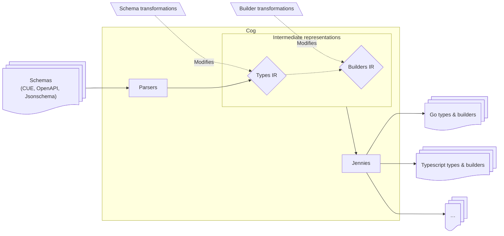

# Codegen pipelines

Code generation is configured via a *codegen pipeline* describing:

* the schemas used as input
* possible transformations applied to the schemas
* possible transformations applied to the builders
* the desired outputs

The diagram below describes – from a high-level perspective – how `cog` runs such a pipeline:

